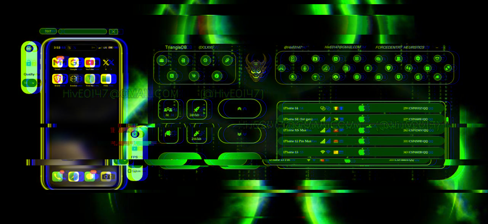

# iOS Kernel UAF

This repository documents **methods** for analyzing memory corruption primitives within the XNU kernel on iOS.

**⚠️ No executable exploit code is provided in this repo.** This is a research framework for defensive security analysis and vulnerability research training.
---

## Community

Join our security research group: [t.me/iospentest](https://t.me/iospentest)
---

## Research Scope

The content here focuses on:

- Identifying use-after-free (UAF) conditions in Mach messaging
- Memory allocator behavior analysis (kalloc, zalloc)
- Race conditions between userland and kernel threads
- Post-free reuse pattern detection

Nothing in this repository is intended for active exploitation. All methods are presented for **educational defense research** and **patch verification**.

---

## Why This Matters

Most public research focuses on *results*. This repository focuses on *process* — the thought patterns, edge case hunting, and allocator behavior mapping that leads to discovery.

Understanding ***how*** an attacker thinks is more valuable for defenders than a pre-written exploit.

---

## Core Research Areas

### 1. Mach Port Lifecycle Analysis

Method: Identify ports manipulated from userland while the kernel maintains a stale reference. The gap between `mach_port_destroy()` and kernel cleanup routines is wider than documented.

### 2. Memory Allocator Entropy Reduction

Method: Heap spraying to make freed memory regions predictable. The XNU zone allocator has deterministic behavior under specific allocation/deallocation patterns.

### 3. Race Window Enlargement

Method: Thread manipulation to increase the window between free and reuse. Scheduler control via priority inversion and CPU core pinning.

### 4. Pointer Validation Bypass

Method: PAC (Pointer Authentication) operates on specific signing schemas. Blind signing with predictable context values remains viable.

---

## Methodologies

| Technique | Difficulty | Description |
|-----------|------------|-------------|
| Cross-zone reuse | Extreme | Forcing allocation from a different zone into freed memory from another zone |
| Entropy exhaustion | High | Repeated allocations to collapse KASLR randomness |
| Scheduler poisoning | Medium | Manipulating runqueues to control which thread reuses freed memory |
| Double-free interleaving | Extreme | Two independent frees of the same memory with controlled operations between |

---

## Affected Versions

Based on public bug reports and diff analysis:

| iOS Version | Status |
|-------------|--------|
| 16.x - 17.4.1 | UAF candidates present |
| 26.4+ | UAF candidates present |

---

## Community

Join our security research group: [t.me/iospentest](https://t.me/iospentest)

---

*Research archive.*
